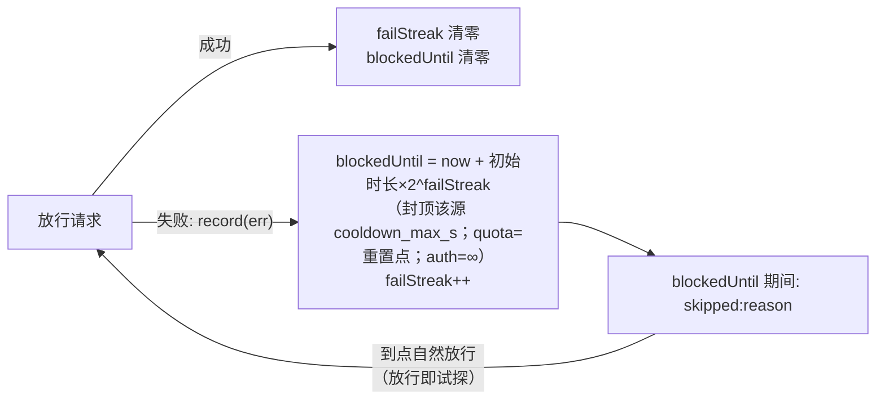
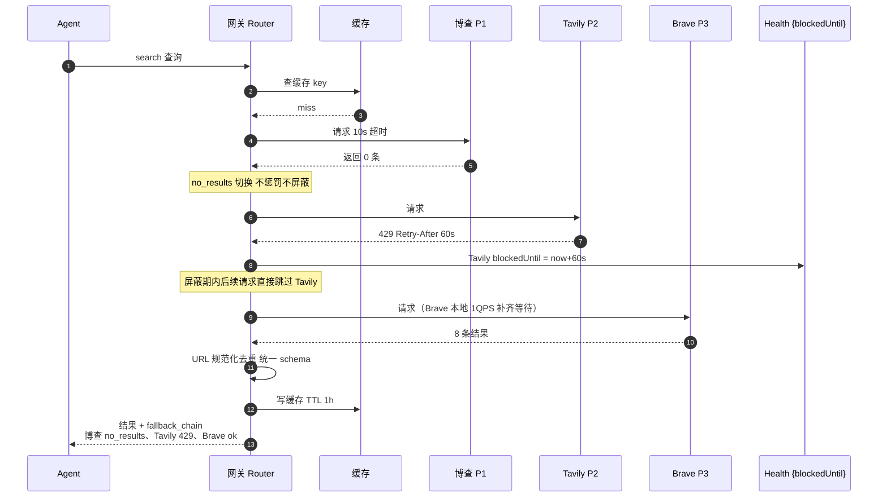

# search-failover — 完整流程图（Mermaid）

配套文档：[mvp-spec.md](mvp-spec.md) v1.2 / [impl-spec.md](impl-spec.md)

## 图 1：一次 `search` 调用的完整流程（对应 spec §3.2 + §6）

> v1.2：任何错误不做同源重试（failover 即重试）；无负缓存。单次调用总预算 `total_budget_ms`（缺省 30s）——每一跳开始前预算耗尽即停止尝试，剩余源记 `skipped: budget_exhausted` 后返回。

```mermaid
flowchart TD
    A["Agent 调用 search"] --> B{"强制指定 provider?"}
    B -->|"是"| P["仅用指定源<br/>绕过缓存"] --> RN
    B -->|"否"| C{"use_cache 允许?"}
    C -->|"否"| RN
    C -->|"是"| D{"缓存命中?"}
    D -->|"命中"| E["按 max_results 截断返回<br/>meta.cache_hit = true"]
    D -->|"未命中"| RN

    RN["Router 取下一个 provider"] --> MORE{"还有源未试?"}
    MORE -->|"有"| S{"blockedUntil > now?"}
    S -->|"是 记 skipped:reason"| RN
    S -->|"否"| BUD{"预算耗尽?"}
    BUD -->|"是 记 skipped:budget_exhausted"| RN
    BUD -->|"否"| U["请求该源 adapter.search<br/>timeout = min(10s, 剩余预算)"]

    U --> V{"结果判定"}
    V -->|"成功 且 ≥ 1 条"| W["quota 计数<br/>failStreak 清零"] --> X["URL 规范化 + 同源去重"]
    X --> Y["写缓存<br/>普通 1h / fresh=day 15min"]
    Y --> Z["返回 results + meta<br/>provider_used + fallback_chain"]

    V -->|"空结果"| N["记 no_results<br/>不惩罚不屏蔽"] --> RN
    V -->|"429 / DDG 202·403"| RL["blockedUntil = now + Retry-After<br/>缺省60s 封顶3600s（DDG封禁 6h）"] --> RN
    V -->|"配额信号"| QE["blockedUntil = 重置点<br/>余额制: now + 6h"] --> RN
    V -->|"401 / Brave 422 鉴权"| AF["blockedUntil = ∞<br/>status 标红 需人工"] --> RN
    V -->|"timeout / network"| TO["blockedUntil = now + 30s<br/>不重试 直接切"] --> RN
    V -->|"5xx / 未识别 4xx"| SE["blockedUntil = now + 60s<br/>重复失败阶梯翻倍"] --> RN

    MORE -->|"无 全部耗尽"| EMPTY["返回 results = 空数组<br/>+ 完整 fallback_chain<br/>不报错 进程不崩"]
```

## 图 2：Provider 健康管理（v1.2：一个结构替代状态机，spec §6.2）

每源只有 `{blockedUntil, reason, failStreak}`，没有状态机：

## 图 3：典型场景时序（图 1 的实例化）

场景：某查询下 博查返回空、Tavily 限额、Brave 成功返回 8 条

